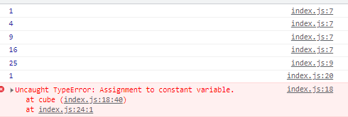

1. Concept of var, let, and const 

a. Var is used to access the declared variable both inside and outside the block of code as shown in the example 

function square() 
{ 
    for(var number=1;number<5; number++) 
    { 
        console.log(number*number);  
    } 
    console.log(number*number);  
} 

square(); 
 

Difference is if we use var to declare a variable we can use the number to  
display inside for loop as well as outside the loop but inside the funtion 

b. But using const or let we cant do that. It will throw an error 
 

function cube() 
{ 
    for(let number=1;number<5; number++) 
    { 
        console.log(number*number*number);  
    } 
} 
cube();
 

In the above case we cannot use const as the value gets mutiplies three times and it is changable.  
In such case it is better to use let. 

2. Arrow function 
Arrow function in modern js is amazing. It makes the block of code cleaner and increase code quality. 
Let's take above function to convert using arrow function 

const result=()=> {for(var number=1;number<5; number++){console.log(number*number); }} 
result();
 

Another example 
const res = num=>console.log(num+num); 
res(3);
 

More use of arrow function including the use of filter() function 

const jobs=[ 
    {
        id:1,
        title:'Laravel Dev',
        Salary:2000000,
        isActive:true
    },
    {
        id:2,
        title:'React Dev',
        Salary:3000000,
        isActive:true
    },
    {
        id:3,
        title:'Dot Net Dev',
        Salary:4000000,
        isActive:false
    }
]
 
Lets create a function in both traditional and moder way of JS 

a.Traditional way 

const checkIsActive = jobs.filter(function(jobs){ 
    return console.log(jobs.isActive); 
})
 
b. Modern way 

const checkJobStatues = jobs.filter(jobs=>console.log(jobs.isActive)); 
 

Write a function to display odd number between 1 to 50 

const oddNumbers = ()=>{for(let i=1;i<50;i++){if(i%2 !=0){console.log(i+2)}}}; 
oddNumbers();
 

3.Lets use map() function 
const colors = ['Red','Green','Blue']; 

a. Traditional method 
const mapColor = colors.map(function(colors){ 
    return console.log(`It's ${colors}`); 
}); 

b. Modern method 
const colorItem = colors.map(colors=>console.log(`It's ${colors}`)); // `` is called template literal  
 
4. Object Destructuring 

const address ={ 
    id:1,
    street:12,
    city:'Pokhara',
    country:'Nepal'
}
 
If we want to access object properties without using object destructuring 

const street= address.street; 
const city = address.city; 
const country = address.country; 
console.log(country); 

If we use object destructuring it will be easier to access all those properties 

const {street,city,country}= address; 
console.log(`Street:${street}, City:${city}, Country:${country}`); 

If we want to use different constant for that properties 
const{ city:ct} = address;
 
5. Spread Operators 

It works same as like concat() function but a little bit different 
Suppose we want to combine two arrays what we do is the following 
const num1 = [1,2,3,4]; 
const num2 = [7,8,9,10]; 

const combined = num1.concat(num2); 
console.log(combined);
 

What if we need to add one or more array elements between num1 and num2 
In this situation spread operator is useful we can use it using three dots "..." like following 
const combinedNum =[...num1,5,6,...num2]; 
console.log(combinedNum); 
 
Simply we can do this for objects too

const info ={ 
    id:1, 
    fname:'Shivam' 
} 

const fullInfo = {...info, lname:'Ranabhat'} 
console.log(fullInfo); 

//Inheritance in js 
class Animal 
{ 
    constructor(type) 
    { 
        this.type = type; 
    } 
    eat() 
    { 
        console.log(`Hello. Im ${this.type}.`); 
    } 
} 
class Person extends Animal 
{ 
    constructor(name,type) 
    { 
        super(type); 
        this.name = name; 
    } 
    walk() 
    { 
        console.log(`My name is ${this.name}.I can walk with two legs`); 
    } 
} 
const person = new Person("Shivam","Human"); 
person.eat(); 
person.walk(); 